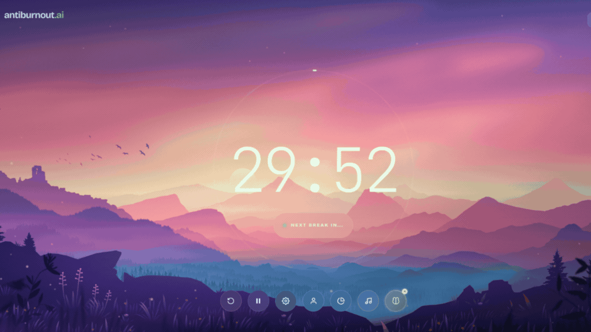

<div align="center">

# AntiBurnout.ai

AI-powered desktop wellness assistant that prevents digital burnout during long screen sessions.

[](#)
[](#)
[](#)

</div>

<p align="center">
  
</p>

---

## Quick Setup

### Prerequisites
- Python 3.10+
- Node.js 18+
- MongoDB Atlas (optional — falls back to local JSON)

### Backend

```bash
cd backend
python -m venv venv
venv\Scripts\activate              # Windows
# source venv/bin/activate         # macOS/Linux
pip install -r requirements.txt
copy .env.example .env             # Edit with your values
python main.py                     # http://localhost:8000
```

### Frontend

```bash
cd desk-app
npm install
copy .env.example .env
npm run dev                        # Opens Electron app
```

On first launch, configure your **OpenRouter API key** in Profile Settings.

---

## Environment Variables

### Backend (`backend/.env`)

```env
SECRET_KEY=your-secret-key
ALGORITHM=HS256
ACCESS_TOKEN_EXPIRE_MINUTES=30
MONGODB_URI=mongodb+srv://...       # optional
MONGODB_DB_NAME=antiburnout         # optional
YTKEY=AIza...                       # optional (for music search)
```

### Frontend (`desk-app/.env`)

```env
VITE_API_URL=http://localhost:8000
```

---

## Available Scripts

| Command | Description |
|---------|-------------|
| `npm run dev` | Vite dev server (browser) |
| `npm run electron:dev` | Electron desktop app |
| `npm run electron:dev:watch` | Electron with hot-reload |
| `npm run build` | Production build |
| `npm run electron:build:win` | Package as .exe |
| `npm run electron:build:mac` | Package as .dmg |
| `npm run electron:build:linux` | Package as AppImage |

---

## Documentation

- **[Architecture & Features](DETAIL.md)** — full system design, all features, tech stack, API reference

---

## License

MIT
